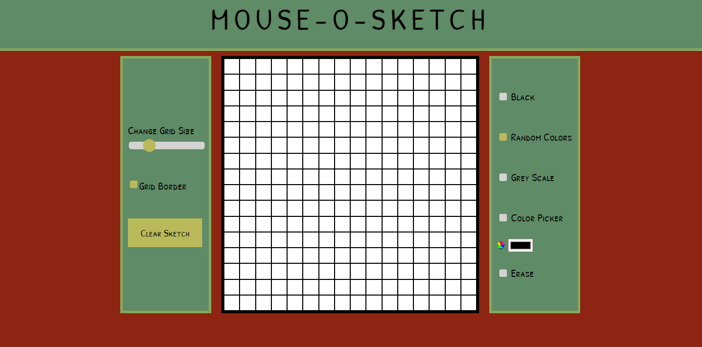
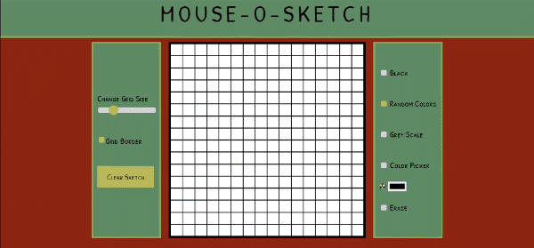

# Mouse-O-Sketch

Source code for my [Mouse-O-Sketch](https://timkrausedev.github.io/mouse-o-sketch/), built with vanilla JS and CSS.

## Overview

This Mouse-O-Sketch application is a fun way to mess around. Use the colors or change the amount of cells in the sketch board, then makes some cool stuff!

 

## Technology Used
The technology used to create this portfolio include:

- HTML
- CSS
- Vanilla JS

## Contact
If you have any questions about the front-end project, my work or if you have any opportunities you would I would be a good fit for, please [contact me](https://timkrause.dev/#contact).